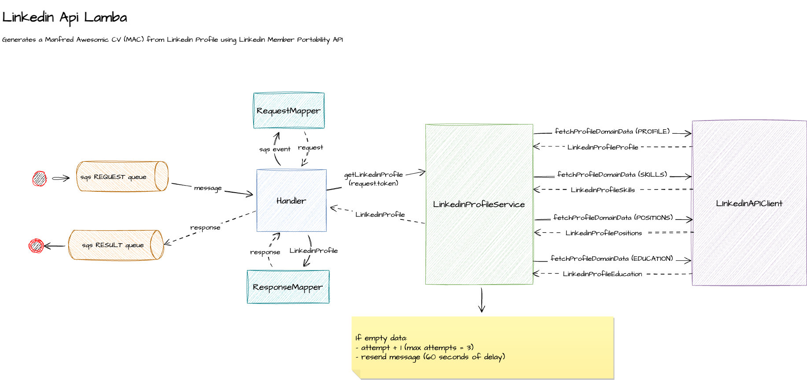

# Linkedin API Lambda

This Lambda function processes requests to import LinkedIn profiles. It uses LinkedIn's [Member Data Portability (Member) API](https://learn.microsoft.com/en-us/linkedin/dma/member-data-portability/member-data-portability-member/?view=li-dma-data-portability-2024-08) to retrieve relevant profile data and returns a CV in [MAc format](https://github.com/getmanfred/mac).

_Note: This API is available only to LinkedIn users registered in the European Union._



# Environment variables

TBD

# How to develop

Follow these steps to set up the development environment and run essential tasks for the project:

- If you're part of Manfred's staff, download the necessary environment variables using [Doppler](https://www.doppler.com/):

  ```bash
    npm run dev:secrets
  ```

- Run the application locally with a fake sqs event. This uses the `LOCAL_PROFILE_API_TOKEN` environment variable to retrieve the LinkedIn profile:

  ```bash
    npm run dev
  ```

- Automatically lint the code and apply fixes to linting and formatting errors:

  ```bash
    npm run lint
  ```

- Execute the unit test suite to ensure that everything is working as expected:

  ```bash
    npm run test
  ```

Make sure you have all necessary environment variables and dependencies set up before running the tasks.

# References

- https://learn.microsoft.com/en-us/linkedin/dma/member-data-portability/member-data-portability-member

# ⌛️ TODO: List

- Core logic
  - error handling, detect "empty" response (not yet connected)
  - measure time and return to storage in DB for metabase stats
  - more tests, integration test?
- Github action to deploy in aws
- Send result to SQS queue
- Script to get linkedin token
- Review dates parser: fallback MMM yyyy -> yyyy ?
